<div align="center">

# OpenGL Simulations

A Repository of Real-time Simulations: GPU fluid simulation (2D/3D), Collision Detection, Rubiks Cube Solver, Cube Marching and Procedural Geometry.

</div>

## Table of Contents

- Overview
- Features
- Prerequisites
- Build (Windows)
- Run the programs
- Controls
- Project structure
- Performance notes
- Troubleshooting
- License


## Overview

This suite projects that  implement multiple simulation systems with modern OpenGL (core profile) and compute shaders for GPU-accelerated algorithms and physics. It includes SPH-based fluid simulation (2D/3D), a determimnistic multithreaded particle collision system, a rubiks cube solver visualization, cube marching visualization and a small set of procedural geometry tools.

## Features

- GPU Fluid Simulation (2D/3D) using SPH + spatial hashing
- Deterministic Particle Collision System with uniform grid partitioning and multithreading
- Rubiks Cube solver using Thistlethwaite's Algorithm
- Marching Cube and Signed Distance Function algorithms
- Procedural geometry: parametric surfaces, polygons, spheres, and helpers
- Modern OpenGL 3.3+ rendering, OpenGL 4.3+ compute shaders
- GLM math, GLFW windowing/input, GLAD loader, optional Assimp model loading

## Prerequisites

- Windows 10/11 with a GPU that supports OpenGL 3.3 (4.3+ recommended for compute shaders).
- CMake 3.15 or newer (3.27+ recommended).
- Visual Studio 2019/2022 with the Desktop development with C++ workload (or the MSVC Build Tools + Ninja).
- PowerShell 7+ or Windows Terminal for running the build commands.
- Git (optional, but recommended for pulling updates).
- Internet access on the first configure so CMake can download third-party libraries.


## Dependency management (automatic)

1. Clone the repository: `git clone https://github.com/Programmer-5090/Simulations-OpenGL.git`
2. Configure the project: `cmake -B build -S . -G "Visual Studio 17 2022" -A x64`
3. During the first configure CMake will fetch/build:
   - GLFW 3.4
   - GLAD (OpenGL loader)
   - GLM 1.0
   - Assimp 5.3 (compiled statically)
   - SFML audio/system modules (for Rubik’s Cube + audio tests)
   - `stb_image.h`
4. Dependencies are cached inside `build/_deps`. Subsequent configures reuse the downloads; delete `build/_deps` if you ever want to force a refresh.
5. If you must build offline, run the configure step once while online and archive `build/_deps` for reuse.

## Program details and configs

All paths are relative to the repo root.

1) GPUFluidSim 2D
- OpenGL context: 4.3 Core (compute shaders)
- Window: 1200 x 800
- Default particles: 10,000
- Shaders: `SPHFluid/shaders/FluidSim-2D.compute`, `SPHFluid/shaders/particle2d.vs`, `SPHFluid/shaders/particle2d.fs`
- World bounds: x=[-10, 10], y=[-6.67, 6.67]

2) GPUFluidSim 3D
- OpenGL context: 4.3 Core (compute shaders)
- Window: 1280 x 720
- Default particles: 10,000
- Shaders: `SPHFluid/shaders/FluidSim-3D.compute`, `SPHFluid/shaders/particle3d.vs`, `SPHFluid/shaders/particle3d.fs`, `SPHFluid/shaders/box.*`, `shaders/infinite_grid.*`
- Simulation bounds: axis‑aligned box of size 4 x 4 x 4

3) CollisionSystem (2D)
- OpenGL context: 3.3 Core
- Window title: 1280 x 800 (Resizable)
- Auto‑spawning streams from the left edge; performance‑aware throttling

4) RubiksCube + solver tests
- `RubiksCube` is the interactive viewer/solver.
- `RubiksStateTest` and `RubiksSolverTest` are headless executables that validate cube IDs and solver heuristics.

5) MarchingTest (CPU/GPU marching cubes)
- Visualizes marching cubes tables on the CPU for quick experimentation.
- Targets: `MarchingTest`, `testGPU`, `testCPUBunny` (each with its own executable in `output/<Name>/<Config>/`).

6) debugBVH
- Standalone viewer for the BVH structures generated by the marching cubes experiments.
- Useful when tuning subdivision or debugging occupancy issues.

7) OpenGLProject
- OpenGL context: 3.3 Core
- Demonstrates geometry and basic rendering with an infinite grid
- Shaders: `shaders/vertex.vs`, `shaders/simple_fragment.fs`, `shaders/infinite_grid.*`, optional normal debug `shaders/normal_debug.*`

8) AudioTest
- Minimal SFML audio harness that plays the bundled `audio/beep.wav` to confirm your audio device/driver setup.

## Build (Windows)

Everything is driven by plain CMake commands, so any terminal (VS Developer Prompt, PowerShell, etc.) works the same way. Dependencies download automatically into `build/_deps` during the first configure step.

1) Configure the project (generator/arch optional):
```
cmake -B build -S . -G "Visual Studio 17 2022" -A x64
```
2) Build all targets in Debug:
```
cmake --build build --config Debug
```
3) Build Release (recommended for demos):
```
cmake --build build --config Release
```
4) Build a specific target/variant (example for `debugBVH` Release):
```
cmake --build build --config Release --target debugBVH
```

Executables land under `output/<TargetName>/<Config>/` (for example `output/OpenGLProject/Debug/OpenGLProject.exe`), so each folder is self-contained. A Visual Studio solution is still generated at `build/OpenGLProject.sln` if you prefer opening it directly in VS.

## Run the programs

After a build, each executable lives in `output/<Target>/<Config>/`. Launch them straight from PowerShell or CMD; swap `Release` for `Debug` as needed.

Primary demos:
- GPUFluidSim 2D: `.\output\GPUFluidSim2D\Release\GPUFluidSim2D.exe`
- GPUFluidSim 3D: `.\output\GPUFluidSim3D\Release\GPUFluidSim3D.exe`
- Collision System: `.\output\CollisionSystem\Release\CollisionSystem.exe`
- OpenGL Project: `.\output\OpenGLProject\Release\OpenGLProject.exe`
- Rubik's Solver: `.\output\OpenGLProject\Release\RubiksCube.exe`

Additional demos/tests:
- Marching cubes: `.\output\MarchingTest\<Config>\MarchingTest.exe`, `testGPU.exe`, `testCPUBunny.exe`
- debugBVH viewer: `.\output\debugBVH\<Config>\debugBVH.exe`
- Rubik's Test suite: `RubiksStateTest.exe`, `RubiksSolverTest.exe`
- Audio Test: `.\output\AudioTest\<Config>\AudioTest.exe`

For quick one-offs you can also build and run a single target via CMake:
```
cmake --build build --config Release --target GPUFluidSim3D
.\output\GPUFluidSim3D\Release\GPUFluidSim3D.exe
```

## Shareable bundles

Each executable now has an isolated runtime folder under `output/<Target>/<Config>/` that contains the binary, required DLLs, and only the assets it truly needs (for example, `RubiksCube` ships just its two shader pairs plus the single cube texture and solver tables). Zip that directory to share a standalone build of that specific program.

Note on shader paths: executables load shaders relative to the repo root (e.g., `SPHFluid/shaders/...`). Make sure your current directory is the project root before launching a binary.

## Controls

**GPU Fluid Simulation (2D)**
- Mouse move: interact with the fluid
- Left mouse: attract particles
- Right mouse: repel particles
- Space: pause/resume
- R: reset simulation
- ESC: exit

**GPU Fluid Simulation (3D)**
- Mouse look and scroll wheel: orbit/zoom the camera
- WASD: move horizontally
- Shift: move down
- C: move up
- Space: pause/resume
- R: reset simulation
- ESC: exit

**Collision System (2D)**
- Auto‑spawning particle streams from the left edge
- C: clear all particles
- Space: move on to phase 3
- K: switch images
- ESC: exit

**RubiksCube viewer (interactive solver)**
- Left mouse: select a cubie via raycast; hold middle mouse to orbit, mouse wheel to zoom
- Arrow keys: rotate the face that contains the current selection (mapped to camera orientation)
- Number keys 1‑6: trigger a single U, D, R, L, F, or B quarter turn while idle
- P: scramble ~50 random moves · O: launch the solver queue · G: toggle debug face colors · T: toggle textured stickers
- ESC: exit (RubiksStateTest and RubiksSolverTest are headless and print to the console only)

**MarchingTest (stepwise CPU marching cubes)**
- Mouse look + scroll: move the camera; WASD to translate, C to move up, Left Shift to move down
- N or Right Arrow: process exactly one grid cell
- Space: toggle automatic stepping · G: generate the full mesh once · C: clear mesh/reset stepping
- H: toggle normal visualization · B: toggle chunk bounding box · F: toggle wireframe rendering
- ESC: exit

**testGPU (GPU Marching Cubes)**
- Mouse look + scroll for camera control; WASD, C (up), Left Shift (down) translate the camera
- B: toggle BVH bounding boxes · M: toggle the marched mesh visibility
- ESC: exit

**testCPUBunny (CPU Marching Cubes)**
- Mouse look + scroll, WASD movement, C up, Left Shift down
- ESC: exit

**debugBVH**
- Mouse look + scroll, WASD movement, C up, Left Shift down
- B: toggle BVH boxes · M: toggle bunny mesh visibility
- Up/Down arrows: change which BVH depth level is rendered
- Left/Right arrows: change maximum BVH construction depth (rebuilds the tree)
- ESC: exit

**OpenGLProject demo**
- Mouse look + scroll to control the free camera
- WASD: move horizontally · C: move up · Left Shift: move down
- ESC: exit

**AudioTest**
- Console‑only harness that plays several beep variations automatically; close the console or hit Ctrl+C to stop early


## Project structure

```
├── SPHFluid/             # Fluid simulation (2D/3D) and compute shaders
│   ├── 2D/
│   ├── 3D/
│   └── shaders/
├── Collision System/     # Particle collision detection
├── Rubiks/               # Rubiks cube solver and tests
├── Marching Cubes        # Marching cube algorithm on CPU and GPU
├── geometry/             # Procedural geometry and helpers
├── shaders/              # Vertex/fragment shaders
├── models/               # Assets for demos
├── build/                # CMake build tree (generated)
└── output/               # Built executables (Debug/Release)
```

## Performance notes

- 2D particles: 10k - 15k+ depending on GPU and Window size at 144fps
- 3D particles: 50k - 60k+ at 50 - 60fps
- Collsion System: 15k+ particles at 60fps
- Rubiks Cube Solver: 45 moves or less to solve
- Memory: ~100–200 MB for common presets
- Dedicated GPU strongly recommended for 3D + compute

## Troubleshooting

Black screen or no motion:
- Verify GPU and drivers support OpenGL 4.3+ for compute shaders
- Try the Release build for performance-sensitive paths

Slow performance:
- Reduce particle count and grid resolution in the simulation

Build errors on Windows:
- Ensure CMake and Visual Studio are installed and on PATH
- Use the provided VS Code tasks to avoid environment conflicts

Missing DLLs:
- Visual C++ Redistributable may be required for some systems


## Gallery

### GPU Fluid Simulation 2D

| | | |
|---|---|---|
| 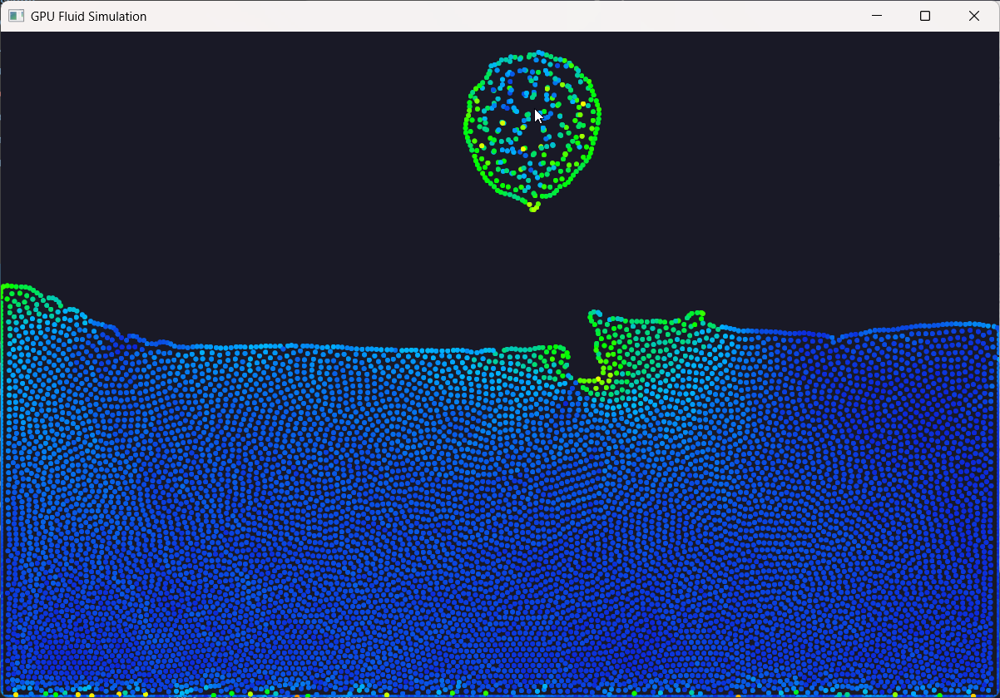 | 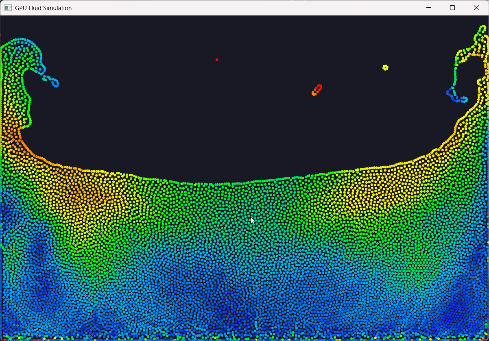 | 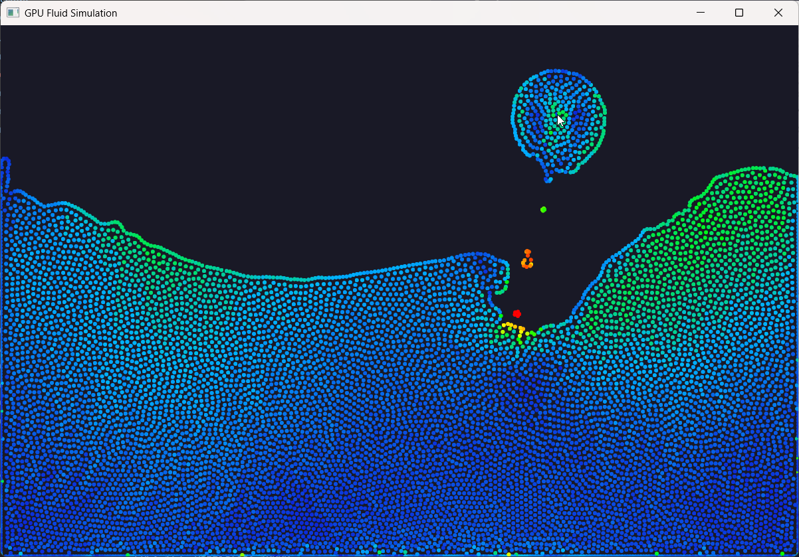 |

### GPU Fluid Simulation 3D

| | |
|---|---|
| 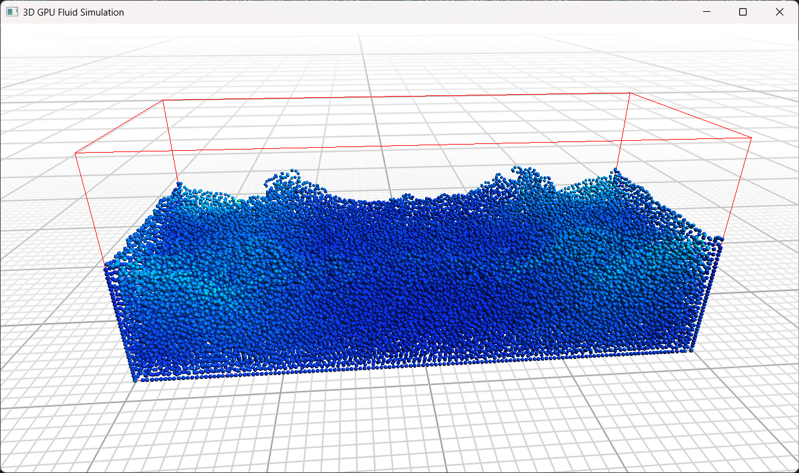 | 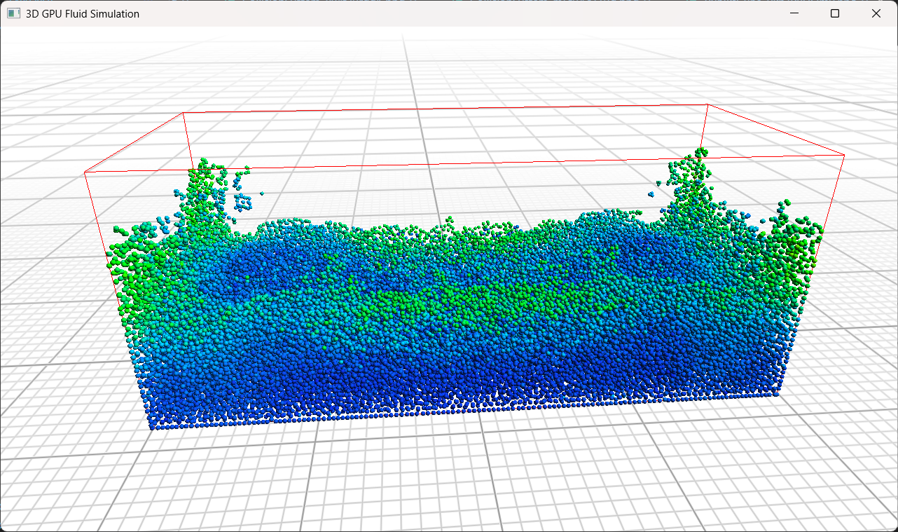 |

### Collision System

| | | |
|---|---|---|
| 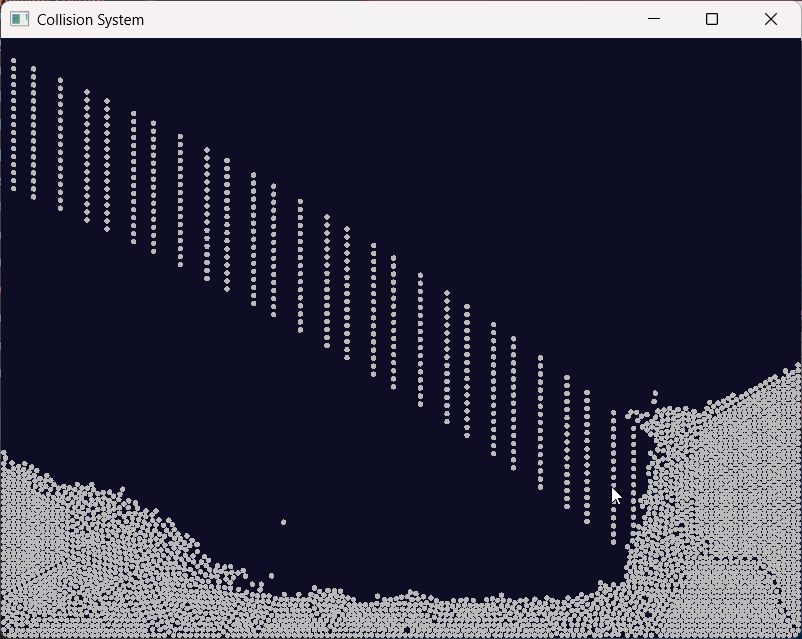 | 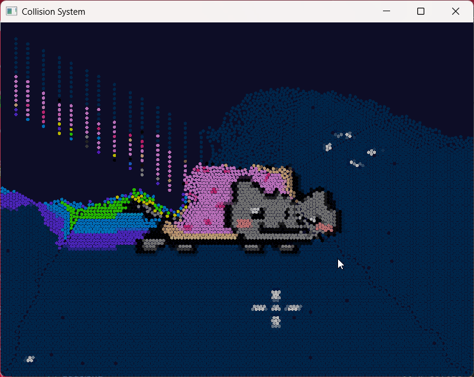 | 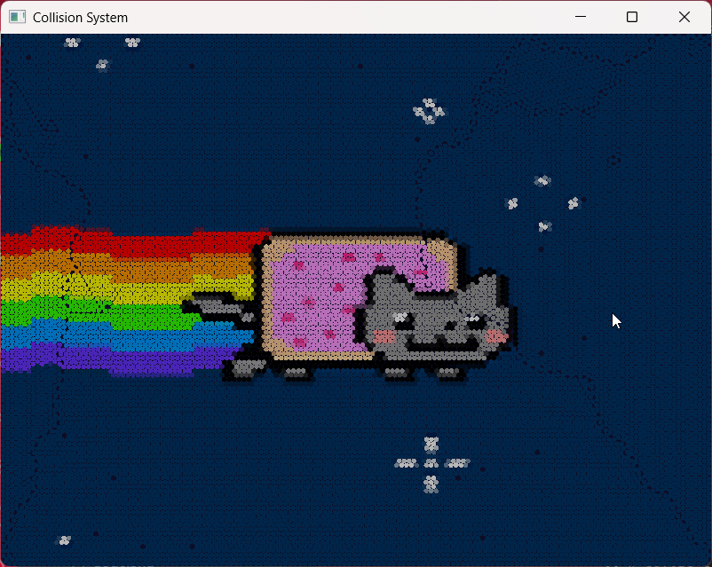 |

### Marching Cubes & BVH Debugging

| | |
|---|---|
| 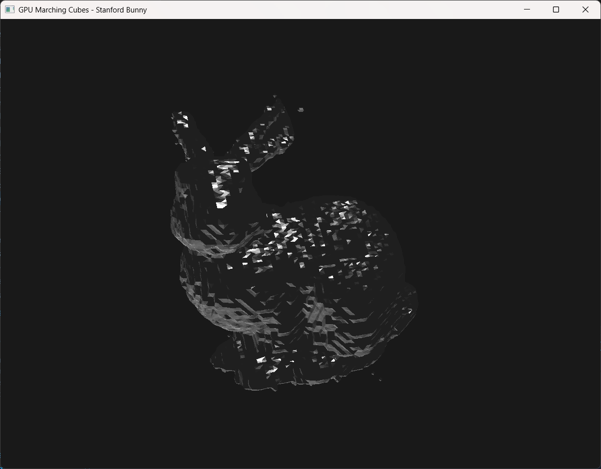 | 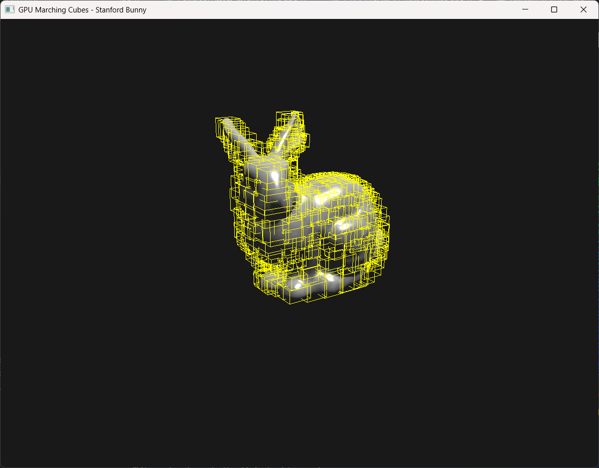 |

### Rubik's Cube Solver

| | |
|---|---|
| 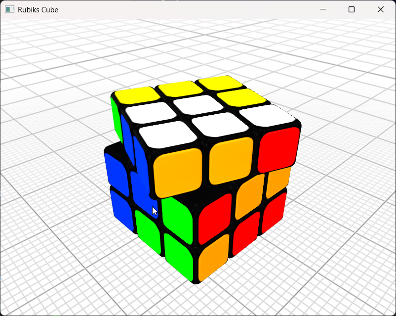 | 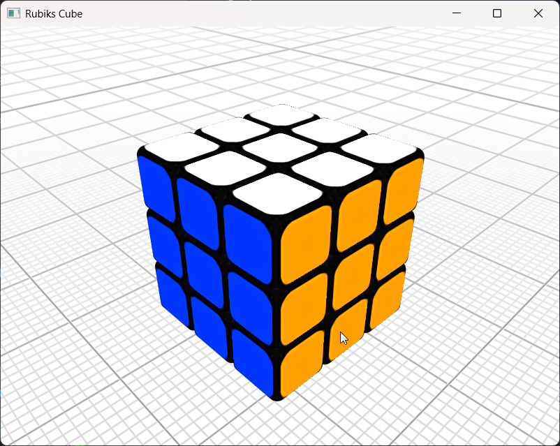 |


# Sources


<a href="https://www.youtube.com/watch?v=rSKMYc1CQHE&t=1155s" target="_blank" rel="noopener noreferrer">
   
</a>

<a href="https://sph-tutorial.physics-simulation.org/pdf/SPH_Tutorial.pdf" target="_blank" rel="noopener noreferrer">SPH Techniques for the Physics Based Simulation of Fluids and Solids</a>

<a href="https://sph-tutorial.physics-simulation.org/slides/01_intro_foundations_neighborhood.pdf" target="_blank" rel="noopener noreferrer">Foundations of SPH</a>

<a href="https://www.youtube.com/watch?v=9IULfQH7E90&t=572s&pp=ygUUY29sbGlzaW9uIHNpbXVsYXRpb24%3D" target="_blank" rel="noopener noreferrer">
   
</a>

<a href="https://github.com/nihaljn/marching-cubes/tree/main*/" target="_blank" rel="noopener noreferrer">Nihaljn Marching Cubes</a>

<a href="https://en.wikipedia.org/wiki/Signed_distance_function" target="_blank" rel="noopener noreferrer">Signed Distance Function</a>

<a href="https://www.jaapsch.net/puzzles/compcube.htm#thisal" target="_blank" rel="noopener noreferrer">Jaapsch Rubik's Solver Blog</a>


# License
This project is provided for educational and research purposes. Third‑party libraries retain their respective licenses.
